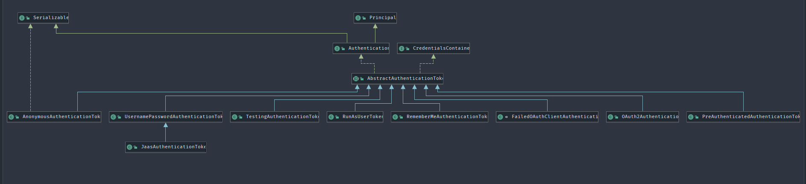

# Spring Security 登录流程

## Authentication



常用的是`org.springframework.security.authentication.UsernamePasswordAuthenticationToken`

##  登陆流程

在Spring Security中,认证和授权相关的校验都是在一系列过滤器链中完成的,在这一系列的过滤器链中,和认证相关的过滤器是`UsernamePasswordAuthenticationFilter`.

```
public class UsernamePasswordAuthenticationFilter extends AbstractAuthenticationProcessingFilter {
    public static final String SPRING_SECURITY_FORM_USERNAME_KEY = "username";
    public static final String SPRING_SECURITY_FORM_PASSWORD_KEY = "password";
    private String usernameParameter = "username";
    private String passwordParameter = "password";
    private boolean postOnly = true;

    public UsernamePasswordAuthenticationFilter() {
        super(new AntPathRequestMatcher("/login", "POST"));
    }

    public Authentication attemptAuthentication(HttpServletRequest request, HttpServletResponse response) throws AuthenticationException {
        if (this.postOnly && !request.getMethod().equals("POST")) {
            throw new AuthenticationServiceException("Authentication method not supported: " + request.getMethod());
        } else {
            String username = this.obtainUsername(request);
            String password = this.obtainPassword(request);
            if (username == null) {
                username = "";
            }

            if (password == null) {
                password = "";
            }

            username = username.trim();
            UsernamePasswordAuthenticationToken authRequest = new UsernamePasswordAuthenticationToken(username, password);
            this.setDetails(request, authRequest);
            return this.getAuthenticationManager().authenticate(authRequest);
        }
    }
```

1. 首先 obtainUsername和obtainPassword获取到用户名和密码.提取的方式就是通过`request.getParameter()`.这也就是为什么Spring Security默认表单登陆使用key/value的形式传递参数,而不能通过json.如果要传json,可以通过修改这里的逻辑实现.
2. 

