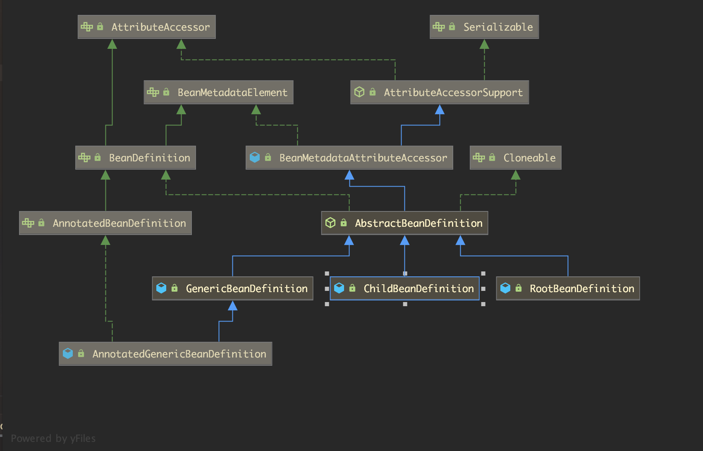

# BeanDefinition

BeanDefinition是Spring用来描述生成Bean的类的元数据信息的一个接口.容器中的BeanDefinitionMap是IOC的一个基础的组成部分,也是非常重要的一个组件.



* BeanDfinition 定义了getter/setter方法
  * BeanMetadataElement
  * AttributeAccessor => AttributeAccessorSupport
* AbstractBeanDefinition 定义了getter/setter方法对应的属性
  * RootBeanDefinition
  * ChildBeanDefinition
  * GenericBeanDefinition
  * AnnotatedBeanDefinition
  * AnnotatedGenericBeanDefinition

demo

```java
@Data
@ToString
public class User {
    private String code;
    private String name;
}
@Data
@ToString
public class Person {
    private String code;
    private String name;
    private String nickName;
}
public class BeanDefinitionInheritApp {
    public static void main(String[] args) {
        AnnotationConfigApplicationContext configApplicationContext = new AnnotationConfigApplicationContext();
        configApplicationContext.register(BeanDefinitionInheritApp.class);

        MutablePropertyValues mutablePropertyValues = new MutablePropertyValues();
        mutablePropertyValues.add("name","荆轲");
        mutablePropertyValues.add("code","jingke");
        RootBeanDefinition rootBeanDefinition = new RootBeanDefinition(User.class,null,mutablePropertyValues);
        configApplicationContext.registerBeanDefinition("user",rootBeanDefinition);
        //configApplicationContext.refresh();
        
        ChildBeanDefinition childBeanDefinition = new ChildBeanDefinition("user");
        childBeanDefinition.setBeanClass(Person.class);
        childBeanDefinition.getPropertyValues().add("nickName","李白");
        configApplicationContext.registerBeanDefinition("person",childBeanDefinition);
        configApplicationContext.refresh();

        User user = configApplicationContext.getBean(User.class);
        Person person = configApplicationContext.getBean(Person.class);

        System.out.println(user);
        System.out.println(person);
    }
}
```

 

```
public interface BeanDefinition extends AttributeAccessor, BeanMetadataElement {
    String SCOPE_SINGLETON = "singleton";
    String SCOPE_PROTOTYPE = "prototype";
    int ROLE_APPLICATION = 0;
    int ROLE_SUPPORT = 1;
    int ROLE_INFRASTRUCTURE = 2;
    void setParentName(@Nullable String var1);
    @Nullable
    String getParentName();
    void setBeanClassName(@Nullable String var1);
    @Nullable
    String getBeanClassName();
    void setScope(@Nullable String var1);
    @Nullable
    String getScope();
    void setLazyInit(boolean var1);
    boolean isLazyInit();
    void setDependsOn(@Nullable String... var1);
    @Nullable
    String[] getDependsOn();
    void setAutowireCandidate(boolean var1);
    boolean isAutowireCandidate();
    void setPrimary(boolean var1);
    boolean isPrimary();
    void setFactoryBeanName(@Nullable String var1);
    @Nullable
    String getFactoryBeanName();
    void setFactoryMethodName(@Nullable String var1);
    @Nullable
    String getFactoryMethodName();
    ConstructorArgumentValues getConstructorArgumentValues();
    default boolean hasConstructorArgumentValues() {
        return !this.getConstructorArgumentValues().isEmpty();
    }
    MutablePropertyValues getPropertyValues();
    default boolean hasPropertyValues() {
        return !this.getPropertyValues().isEmpty();
    }
    void setInitMethodName(@Nullable String var1);
    @Nullable
    String getInitMethodName();
    void setDestroyMethodName(@Nullable String var1);
    @Nullable
    String getDestroyMethodName();
    void setRole(int var1);
    int getRole();
    void setDescription(@Nullable String var1);
    @Nullable
    String getDescription();
    ResolvableType getResolvableType();
    boolean isSingleton();
    boolean isPrototype();
    boolean isAbstract();
    @Nullable
    String getResourceDescription();
    @Nullable
    BeanDefinition getOriginatingBeanDefinition();
}
```


`interface` =>`BeanDefinition`

`abstract class` => `AbstractBeanDefinition`

`implement` => `GenericBeanDefinition` `RootBeanDefinition` `ChildBeanDefinition`


# BeanDefinitionHolder


