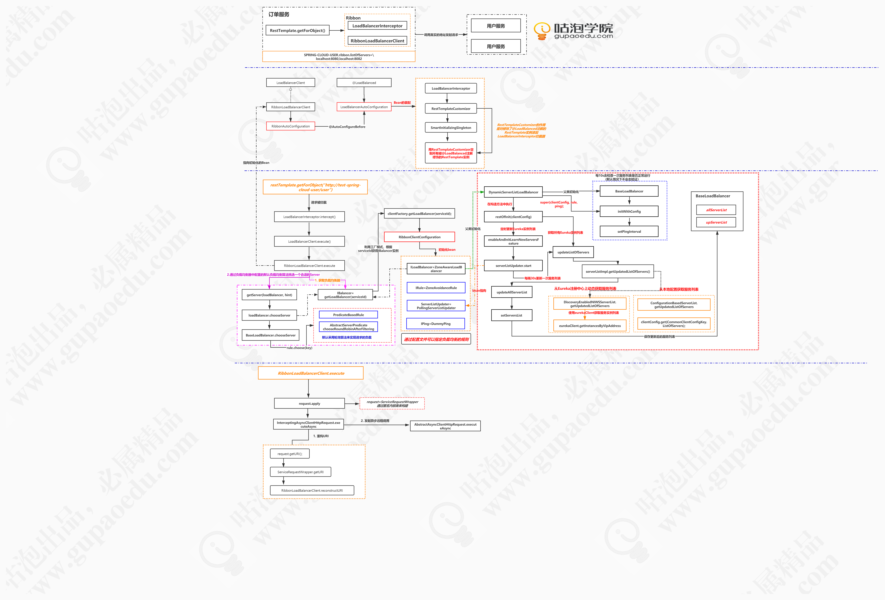

# Spring Cloud Ribbon



`@Qualifier` 标记

```
public class TestClass {

    private String name;

    public TestClass(String name) {
        this.name = name;
    }

    public String getName() {
        return name;
    }

    public void setName(String name) {
        this.name = name;
    }
}

@Configuration
public class TestConfiguration {

    @Qualifier
    @Bean
    public TestClass testClass1(){
        return new TestClass("name1");
    }

    @Qualifier
    @Bean
    public TestClass testClass2(){
        return new TestClass("name2");
    }
}

// 调用
    @Autowired
    @Qualifier
    public List<TestClass> testClassList = Collections.emptyList();

    @RequestMapping("/test")
    public String testController(){
        System.out.println(testClassList.size());// 2
        return "SUCCESS";
    }
```


```
 @LoadBalanced
    @Autowired(
        required = false
    )
    private List<RestTemplate> restTemplates = Collections.emptyList();
```

```
@Target({ ElementType.FIELD, ElementType.PARAMETER, ElementType.METHOD })
@Retention(RetentionPolicy.RUNTIME)
@Documented
@Inherited
@Qualifier
public @interface LoadBalanced {

}
```


* LoadBalancerClient
* @LoadBalanced


```
org.springframework.cloud.netflix.ribbon.RibbonAutoConfiguration#loadBalancerClient

@Bean
@ConditionalOnMissingBean(LoadBalancerClient.class)
public LoadBalancerClient loadBalancerClient() {
	return new RibbonLoadBalancerClient(springClientFactory());
}
```


org.springframework.cloud.client.loadbalancer.ServiceInstanceChooser#choose

ServiceInstanceChooser -> RibbonLoadBalancerClient

