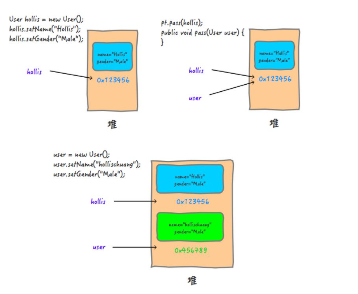
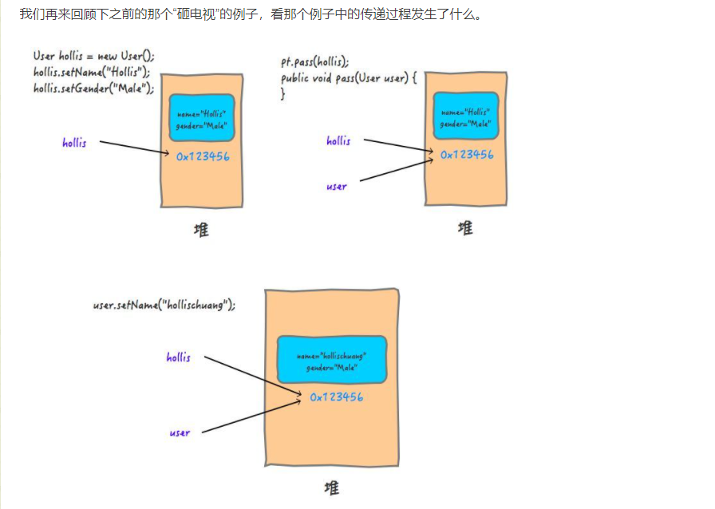
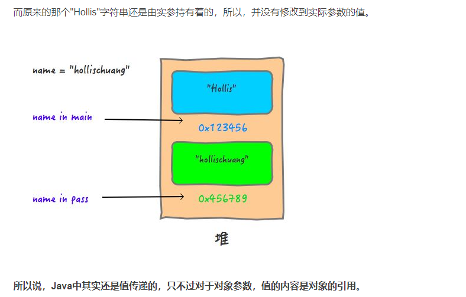

# 为什么Java中只有值传递

Java中只有值传递,对象的话,值的内容是对象的引用.


形参和实参;

* 形参 是在定义函数名和函数体的时候使用的参数,目的是用来接收调用该函数时传入的参数
* 实参 调用有参函数时,主调函数和被调哈数之间有数据传递关系.在主调函数中调用一个函数,函数名后面括号中的参数为实际参数.

```
public class JavaValueDemo {

    public static void main(String[] args) {
        JavaValueDemo javaValueDemo = new JavaValueDemo();
        javaValueDemo.test("张三"); //此处的 "张三" 就是实参
    }

    public void test(String name){ //此处的name就是形参
        System.out.println(name);
    }
}
```

值传递和引用传递

* 值传递 pass by value 是指在调用函数时将实际参数**复制**一份传递到函数中,这样在函数中如果对**参数**进行修改,将不会影响到实际参数;
* 引用传递 pass by reference 是指在调用函数时将实际参数的地址**直接**传递到函数中,那么在函数中对**参数**所进行的**修改**,将影响到实际参数

三种常见案例

情况1

```
public class JavaValueDemo {
    public static void main(String[] args) {
        JavaValueDemo javaValueDemo = new JavaValueDemo();
        javaValueDemo.test("张三"); //此处的 "张三" 就是实参

        int i = 10;
        javaValueDemo.pass(i);
        System.out.println("print in pass ,i is " +i);
     }
    public void pass (int j){
        j = 20;
        System.out.println("print in pass ,j is " +j);
    }
 }
```

控制台输出

```
print in pass ,j is 20
print in pass ,i is 10
```

情况2

```
public class JavaValueDemo {
    public static void main(String[] args) {
        JavaValueDemo javaValueDemo = new JavaValueDemo();
        javaValueDemo.test("张三"); //此处的 "张三" 就是实参

        TestDTO dto = new TestDTO();
        dto.setName("张三");
        javaValueDemo.passDto(dto);
        System.out.println("print in main ,testdto is " +dto);
     }
    public void passDto(TestDTO testDTO){
        testDTO.setName("abc");
        System.out.println("print in pass ,testdto is " +testDTO);
    }
 }
```

控制台输出

```
print in pass ,testdto is TestDTO(name=abc)
print in main ,testdto is TestDTO(name=abc)
```

情况3

```
public class JavaValueDemo {
    public static void main(String[] args) {
        JavaValueDemo javaValueDemo = new JavaValueDemo();
        javaValueDemo.test("张三"); //此处的 "张三" 就是实参

        String name = "王五";
        javaValueDemo.pass(name);
        System.out.println("print in main ,testdto is " +name);
     }
    public void pass(String name){
        name = "李四";
        System.out.println("print in pass ,name is " +name);
    }
 }
```

控制台输出

```
print in pass ,name is 李四
print in main ,testdto is 王五
```

|          | 值传递                 | 引用传递               |
| -------- | ---------------------- | ---------------------- |
| 根本区别 | 会创建副本(copy)       | 不创建复本             |
| 所以     | 函数中无法改变原始对象 | 函数中可以改变原始对象 |

> 你有一把钥匙，当你的朋友想要去你家的时候，如果你直接把你的钥匙给他了，这就是引用传递。这种情况下，如果他对这把钥匙做了什么事情，比如他在钥匙上刻下了自己名字，那么这把钥匙还给你的时候，你自己的钥匙上也会多出他刻的名字。
>
> 
>
> 你有一把钥匙，当你的朋友想要去你家的时候，你复刻了一把新钥匙给他，自己的还在自己手里，这就是值传递。这种情况下，他对这把钥匙做什么都不会影响你手里的这把钥匙。
>
> 
>
> 但是，不管上面哪种情况，你的朋友拿着你给他的钥匙，进到你的家里，把你家的电视砸了。那你说你会不会受到影响？而我们在pass方法中，改变testdto对象的name属性的值的时候，不就是在“砸电视”么。你改变的不是那把钥匙，而是钥匙打开的房子。


https://blog.csdn.net/bjweimengshu/article/details/79799485

```
public static void main(String[] args) {
   ParamTest pt = new ParamTest();

   User hollis = new User();
   hollis.setName("Hollis");
   hollis.setGender("Male");
   pt.pass(hollis);
   System.out.println("print in main , user is " + hollis);
}

public void pass(User user) {
   user = new User();
   user.setName("hollischuang");
   user.setGender("Male");
   System.out.println("print in pass , user is " + user);
}
```



稍微解释下这张图，当我们在main中创建一个User对象的时候，在堆中开辟一块内存，其中保存了name和gender等数据。然后hollis持有该内存的地址`0x123456`（图1）。

当尝试调用pass方法，并且hollis作为实际参数传递给形式参数user的时候，会把这个地址`0x123456`交给user，这时，user也指向了这个地址（图2）。

然后在pass方法内对参数进行修改的时候，即`user = new User();`，会重新开辟一块`0X456789`的内存，赋值给user。后面对user的任何修改都不会改变内存`0X123456`的内容（图3）。

上面这种传递是什么传递？肯定不是引用传递，如果是引用传递的话，在执行user = new User();的时候，实际参数的引用也应该改为指向`0X456789`，但是实际上并没有。

通过概念我们也能知道，这里是把实际参数的引用的地址**复制**了一份，传递给了形式参数。**所以，上面的参数其实是值传递，把实参对象引用的地址当做值传递给了形式参数。**




同样的，在参数传递的过程中，实际参数的地址`0X1213456`被拷贝给了形参，只是，在这个方法中，并没有对形参本身进行修改，而是修改的形参持有的地址中存储的内容。

**所以，值传递和引用传递的区别并不是传递的内容。而是实参到底有没有被复制一份给形参。**在判断实参内容有没有受影响的时候，要看传的的是什么，如果你传递的是个地址，那么就看这个地址的变化会不会有影响，而不是看地址指向的对象的变化。就像钥匙和房子的关系。

那么，既然这样，为啥上面同样是传递对象，传递的String对象和User对象的表现结果不一样呢？我们在pass方法中使用`name = "hollischuang";`试着去更改name的值，阴差阳错的直接改变了name的引用的地址。因为这段代码，会new一个String，再把引用交给name，即等价于：`name = new String("hollischuang")*;*`

