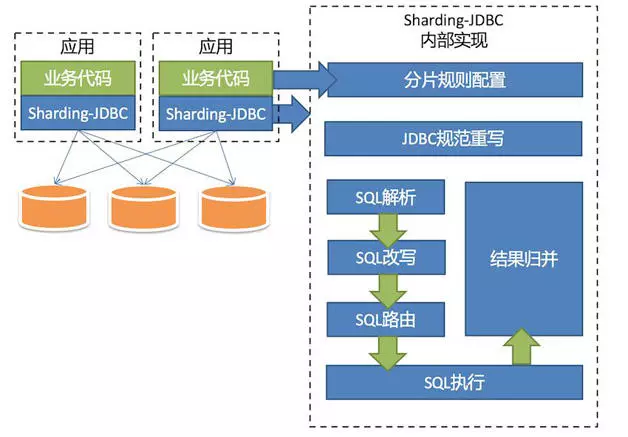

# Sharding-jdbc简介

定位为轻量级java框架,在java的jdbc层提供服务.它使用客户端直连数据库,以jar包形式提供服务,无需额外部署和依赖,可以理解为增强版的jdbc驱动,完全兼容jdbc和各种ORM框架

* 适用于任何基于java的ORM框架,如jpa,hibernate,mybatis,spring jdbc template或直接使用jdbc
* 支持任何第三方的数据库连接池,如DBCP,C3P0,BoneCP,Druid,HikariCP等
* 支持任意实现jdbc规范的数据库.目前支持MySQL,Oracle,SqlServer和PostgreSQL

## 功能列表

### 数据分片

* 分库&分表
* 读写分离
* 分片策略化定制
* 无中心化分布式主键

### 分布式事务

* 标准化事务接口
* XA强一致事务
* 柔性事务

### 数据库治理

* 配置动态化
* 编排&治理
* 数据脱敏
* 可视化链路追踪
* 弹性伸缩(规划中)

## sharding-jdbc核心概念

* 逻辑表 logicTable
* 真实表 AcualTable
* 数据节点 DataNode
* 动态表 DynamicTable
* 绑定表 BindingTable
* 分片键
* 分片算法
* 分片策略

## Shardingjdbc架构图

