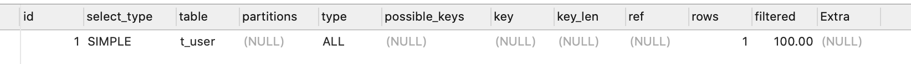
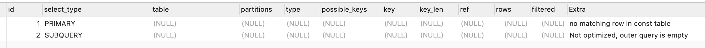
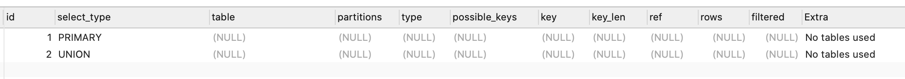

# MySQL explain

```
create table t_user(
user_id bigint not null,
user_name varchar(20) not null,
user_birthday date not null,
primary key(user_id)
);

create table t_group(
group_id bigint not null,
group_name varchar(20) not null,
primary key(group_id),
key AK_group_name(group_name)
);

create table t_group_user(
	group_id BIGINT not null,
	user_id BIGINT not null,
	summary varchar(100),
	primary key(group_id,user_id)
);
```

## explain 执行计划

在SQL语句前加explain关键字,MySQL会在查询设置一个标记,模拟MySQL优化器来执行SQL语句,执行查询时,会返回执行计划的信息,并不执行这条SQL.(注意,如果from中包含子查询,仍然会执行该子查询,将结果放入临时表)

explain 可以用来分析SQL语句和表结构的性能瓶颈.通过explain结果,可以了解入数据表的查询顺序,数据查询操作的操作类型,哪些索引可以被命中,哪些索引实际会命中,每个数据表有多少行记录被查询等信息

> explain 结果是基于数据表中现有数据的;
>
> explain 结果与MySQL版本有很大关系,不同版本的优化器的优化策略不同;

`explain select * from t_user;`



`explain select (select 1 from t_group_user t2) from (select * from t_user where user_Id=1) t1`



`explain select 1 union all select 2 from dual`



explain结果列说明

* id id是一个有顺序的编号,是查询的编号.id的顺序是按照select出现的顺序增长的. id值越大越先执行,id值相同的从上乡下执行,id为null的最后执行;

* select_type 标明查询的类型

  * simple 标明当前行的查询是简单查询,不包含union和子查询
  * primary 标明当前行对应的select是复杂查询的最外层select
  * subquery 标明当前行对应的select是包含在select中的子查询(不在from字句中)
  * derived 标明当前行对应的select是包含在from子句中的子查询
  * union 标明当前行对应的select是在union中的第二个和随后的select 
  * union result 标明当前行对应的select是从union临时表检索结果的select

* table 标明当前行对应的select访问的是哪张表.

* type 标明当前行对应的select的关联类型或者访问类型.也就是优化器决定怎么查找数据表中的行,以及查找数据行记录的大概范围. null> system> const >eq_ref>ref>range>index>ALL. 一般来说,要保证查询达到range级别,最好是ref.

  * null MySQL优化器在优化阶段分解查询语句.在优化过程中已经可以得到结果,那么在执行阶段就不用再访问索引或者表.

  ```
  select min(user_id) from t_user;
  ```

  * const 和system const 出现在用primary key 或者unique key 的**所有列与常数比较**时,优化器对查询进行优化并将其部分查询转化为一个常量.最多有一个匹配行,读取一次,速度非常快. system是const的特例,表中数据只有一条匹配时为system.
  * eq_ref primary key 或者unique key 索引的**所有构成部分**被join使用,只会返回一条符合条件的数据化.这是仅次于const 的连接类型.
  * ref 与eq_ref相比,ref类型不是使用primary key或者unique key 等唯一索引.而是使用普通索引或者联合唯一索引的部分前缀,索引与某个值相比较,可能会找到符合条件的多个数据行.

  ```
  explain select * from t_group where group_name = 'group1';
  
  explain select t.group_id from t_group t left join t_group_user t1 on t.group_id = t1.group_id;
  ```

  

  * range 出现在 in,between,<,>,>=等操作符中.使用一个索引来查询给定范围的行.
  * index 扫描全表索引(index是从索引中读取的,所有字段都有索引,而all是从硬盘中读取),比all快.
  * all 全表扫描,需要从头到尾查找所需要的行.一般这种情况下需要增加索引来进行查询优化

* possible_keys 这一列的结果标明查询可能使用到哪些索引.有些时候也会出现possible_keys 列有结果,而后面的key列显示null的情况,这是因为此时表中的数据不多,优化器认为查询索引对查询帮助不大,所以没有走索引查询而是进行了全表扫描.

  如果possible_keys列的结果为null,则标明没有相关的索引,这时可以通过优化where子句,增加恰当的索引来提升查询性能.

* key 标明优化器实际采用哪个索引来优化对该表的访问,如果没有使用索引,则该列为null.

* key_len 这一列表明了在索引里使用的字节数,通过这个值可以大致估算出具体使用了联合索引中的前几个列.

* ref 这一列标明了在key列记录的索引中,表查找值所用到的列或常量.常见的有const (常量)和字段名(比如user.user_id)

* rows 这一列标明优化器大概要读取并检测的列数.跟实际的数据行大部分情况是不一致的

* Extra 这一列对优化SQL非常有参考意义.常见的重要取值如下

  * using index 所有被查询的字段都是索引列(覆盖索引),并且where条件是索引的前导列,出现这样的结果,是性能高的表现
  * using where 被查询的列未被索引覆盖,where条件也并非索引的前导列,表示MySQL执行器从存储引擎接收到查询数据,再进行后过滤(post-filter 就是先读取整行数据,再检查此行是否符合where句的条件,符合就留下,否则就丢弃)
  * using where using index 被查询的列被索引覆盖,并且where条件是索引列之一但是不是索引的前导列,也就是没有办法通过索引来查询到符合条件的数据.
  * null 被查询的列没有被索引覆盖,但where条件是索引的前导列,此时用到了索引,但是部分列未被索引覆盖,必须通过"回表查询"来实现,不是纯粹的用到了索引,也不是完全没有用到索引.
  * using index condition 与using where类似,查询的列不完全被索引覆盖,where条件中是一个前导列的范围
  * using temporary 这标明需要通过创建临时表来处理查询,出现这种情况一般是要进行优化的,用索引来优化.创建临时表的情况:distinct ,group by, order by ,子查询等.
  * using filesort 在使用order by 的情况下出现,mysql会对结果使用一个外部索引排序,而不是按照索引次序从表里读取行.此时MySQL会根据联接类型浏览所有符合条件的记录,并保存排序关键字和指针,然后排序关键字并按照树勋检索行信息.这种情况下要考虑使用索引来优化.

## 查询优化建议

首先看type列的结果,如果有类型是all,表示预计会进行全表扫描.通常全表扫描的代价比较大,建议创建适当的索引.通过索引检索避免全表扫描.

再看extra列的结果,如果出现using temporary或者using filesort 则要多加关注


## 索引使用情况分析

```
create table t_demo (
 demo_id bigint not null,
 c1 varchar(10)not null,
 c2 varchar(10) not null,
 c3 varchar(10) not null,
 c4 varchar(10) not null,
 primary key(demo_id) using BTREE,
 index idx_1_2_3(c1,c2,c3) using BTREE
);
```


```
explain select * from t_demo where c1='d1' and c3='d3' and c2='d2';
# 索引在where条件后无论顺序都能使用到索引;
explain select * from t_demo where c1='d1' and c2>'d2' and c3='d3';
# 范围右侧索引失效,使用到了两个索引;
explain select * from t_demo where c1='d1' and c2 ='d2' and c3>'d3';
# 由于优化器的原因,使用到了全部三个索引;

explain select * from t_demo where c1='e' and c2 ='d2' order by c3;

explain select * from t_demo where c1='e' and c3 ='d2' order by c2;
```

## 总结

两种方式的排序 filesort 和index, index走索引效率高;

order by 满足两种情况下会使用using index

* order by 语句使用索引最左前列
* 使用where子句与order by 子句条件列组合满足索引最左前列

尽量在索引列排序,遵循索引建立顺序

Group by 与 order by 很类似,都是先排序后分组,遵循索引创建顺序的最佳左前缀法则.

